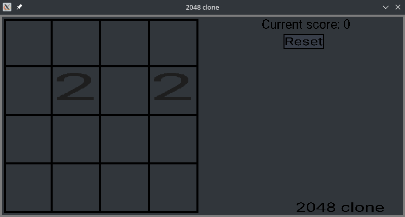
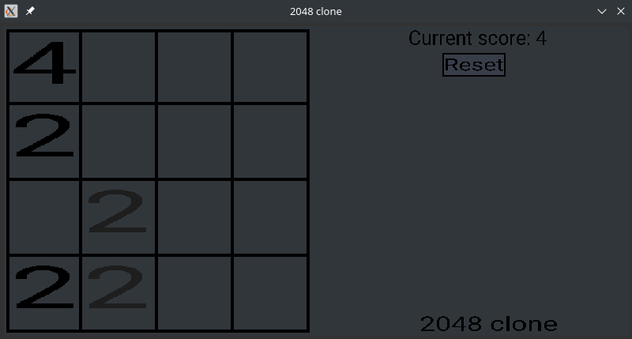
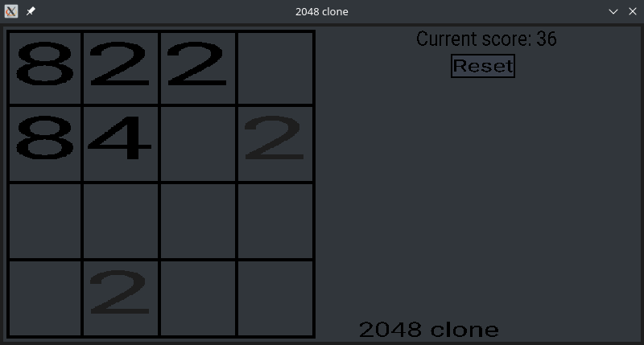

# A clone of the game '2048'

The game is written in C using the 
[Simple DirectMedia Layer](https://www.libsdl.org/) 
library.

## Screenshots





## Build

Libraries SDL2 and SDL2_ttf are required to build & run this game. 
Download these libraries from their official GitHub releases pages
[libsdl-org/SDL](https://github.com/libsdl-org/SDL/releases) 
and [/libsdl-org/SDL_ttf](https://github.com/libsdl-org/SDL_ttf/releases). 

Build libraries with CMake (on Linux):
```shell
# Inside each downloaded library's directory 
# and then inside the game directory
mkdir cmake-build-debug
cd cmake-build-debug
cmake .. && make all
```

Copy or move static (.a) and dynamic (.so) libraries to 
`_gamerepo_/libs/_libdir_/bin`, then copy header files from 
`include` dir which is located in each library's root directory 
to `_gamerepo_/libs/_libdir_/include/_libdir_`. `_gamerepo_` 
stands for the root directory of this repository, `_libdir_` 
stands for 'sdl' and 'sdl_ttf'. Change `#include "*.h"` to 
`#include <sdl/*.h>` in 'SDL_ttf.h' header file. The game build 
procedure is the same as the libraries build procedure.
